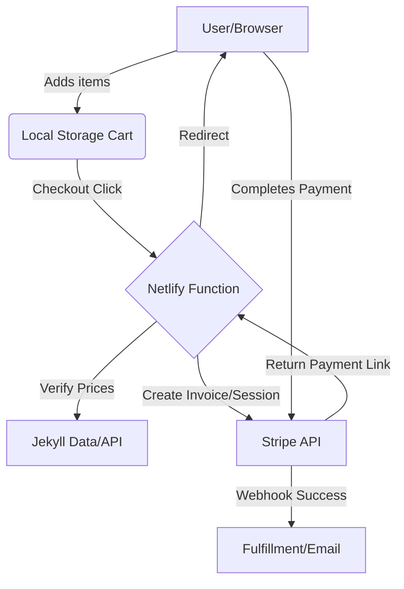

# NetlifyStripeCheckoutSessionTest
The serverless function portion of a Stripe checkout session.

## Flow Diagram



## Allowed Origins

Only the following origins are permitted to connect to this function (configured in `netlify/functions/create-checkout-session.js`):

- `https://www.futuregadgetlabs.com`
- `https://futuregadgetlabs.com`
- `https://futuregadgetcollections.netlify.app`
- `https://futuregadgetcollections.github.io`
- `http://localhost:4000`

To allow additional origins, add them to the `ALLOWED_ORIGINS` array in `netlify/functions/create-checkout-session.js`.

## Setup Instructions

### Step 1: Get Your Stripe API Keys

1. Log in to your [Stripe Dashboard](https://dashboard.stripe.com/)
2. Navigate to **Developers > API keys**
3. Copy your keys:
   - **Publishable key** (starts with `pk_`) - This goes in your store/frontend code
   - **Secret key** (starts with `sk_`) - This will be set as an environment variable in Netlify

### Step 2: Set Up the Netlify Project

1. Create a new site in Netlify by importing this GitHub repository
2. Go to **Site settings > Environment variables**
3. Add a new environment variable:
   - **Key:** `STRIPE_SECRET_KEY`
   - **Value:** Your Stripe secret key (the one starting with `sk_`)

### Step 3: Get Your Function Endpoint

1. After deploying, go to **Logs and metrics** in your Netlify dashboard
2. Click on **Functions** to see your deployed functions
3. Find `create-checkout-session` in the list
4. Your endpoint URL will be in this format:
   ```
   https://your-site-name.netlify.app/.netlify/functions/create-checkout-session
   ```
   For example: `https://stripecheckoutsessiontest.netlify.app/.netlify/functions/create-checkout-session`

### Step 4: Use the Endpoint in Your Store Code

In your store/frontend code, make a POST request to the endpoint with the following payload:

```javascript
const response = await fetch('https://your-site-name.netlify.app/.netlify/functions/create-checkout-session', {
  method: 'POST',
  headers: {
    'Content-Type': 'application/json'
  },
  body: JSON.stringify({
    lineItems: [
      {
        price: 'price_xxxxx', // Your Stripe Price ID
        quantity: 1
      }
    ],
    successUrl: 'https://yourstore.com/success',
    cancelUrl: 'https://yourstore.com/cancel'
  })
});

const { url } = await response.json();
window.location.href = url; // Redirect to Stripe Checkout
```
